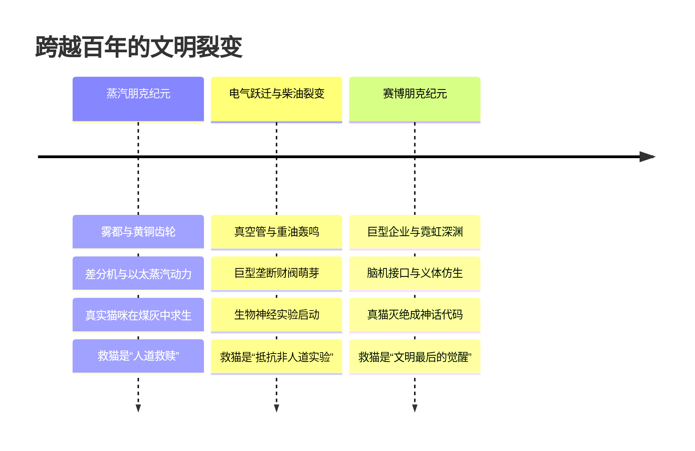

# 世界观设定企划：《发条猫与霓虹雨》（Clockwork & Neon）

## 一、 核心概念与隐喻：为什么是“猫”？

在技术演进的历史长河中，“猫”代表着**未被驯服的生命野性、温热的肉身灵魂、无法被数学算法完全量化的灵动**。

* **蒸汽时代**：“猫”是工人阶级唯一的慰藉，是发条冰冷世界里的唯一热源，也是工业毒烟中对生态崩溃的敏锐金丝雀。
* **过渡时代（电气/柴油）**：猫的神经系统被研究，成为首批脑机接口、伺服义肢的原型实验品（机械猎犬 vs 灵敏的仿生猫）。
* **赛博时代**：真猫几近灭绝，沦为超级财阀的天价私有物与赛博空间的数据图腾。“救猫咪”从救助一只带血肉的流浪猫，升华为**在这个彻底数字异化、算法统治的世界里拯救“最后的肉身温存与人性”**。

---

## 二、 时代演进三部曲：从黄铜到硅晶

### 1. 第一纪元：黄铜与煤烟（维多利亚蒸汽朋克）
* **视觉风貌**：
  * 巨型差分机发出沉闷的敲击声，泰晤士河般的脏水在蒸汽管道排气口下翻滚。
  * 贵族身着蕾丝礼服佩戴黄铜护目镜，贫民窟的孩子在纺织厂轰鸣的飞梭下穿行。
* **技术基石**：
  * **超压差分机（Difference Core）**：庞大的机械计算阵列，用打孔卡片和精密发条计算税收、天气与人口寿命。
  * **以太精炼煤（Aether-Coal）**：燃烧效率高但带有微弱生物神经毒性的新型燃料，排出的“蓝雾”让城市终年不见天日。
* **猫的处境**：
  * 城市的“捕鼠者”与流浪者。机器抢占了空间，老鼠被毒死，流浪猫因吸入蓝雾大量患病（“铁肺病”）。
  * 首个“发条义肢猫”在地下工匠手中诞生——主角为救一只断腿的小猫，用精密钟表零件给它装上了发条后腿。

### 2. 过渡纪元：钢铁巨兽与真空管（电气/柴油裂变期）
* **视觉风貌**：
  * 飞空艇转变为喷气轰炸机，粗笨的钢铁高架桥如蛛网般笼罩老城区。
  * 霓虹灯管的紫红色光晕第一次刺破煤烟，无线电波在雨夜滋滋作响。
* **技术异化**：
  * 工厂主发现机械差分机算力逼近极限，开始尝试**“生物脑计算”**。
  * 猫的敏捷反射弧与神经结构成为脑神经芯片、自动制导鱼雷（“猫脑制导”）的早期耗材。
* **救猫行动**：
  * 从个人怜悯演化为秘密的地下结社（如“黑猫同盟”），他们在实验室被查封前抢运实验猫，建立地下庇护所。

### 3. 第二纪元：义体、巨企与仿生雨（赛博朋克时代）
* **视觉风貌**：
  * 耸入平流层的巨企神殿（底座是百年前锈蚀的维多利亚高架桥），底层是终年不歇的酸雨、全息垃圾广告与合成肉摊。
  * 贫民装载廉价二手液压义体，上层精英则将意识上传至永生量子云。
* **技术现状**：
  * **“猫咪协议”（Protocol Felis）**：真猫已于30年前宣布“功能性灭绝”。现存的所谓“宠物猫”全是有机硅胶皮毛、内置监听芯片的“仿生陪伴伴侣”。
  * 传说世界上最后一只拥有纯正自然基因、未经任何基因修饰与义体改造的纯种肉身猫，被冷冻保存在巨型垄断财阀“奥林匹亚联合发条”的最底层主机机房。
* **救猫行动的终极蜕变**：
  * “救猫”变成了一场赛博反抗行动——救出那只带着古老体温、会发出咕噜咕噜震动的生灵，打破冷酷的算法牢笼。

---

## 三、 关键势力与组织

| 势力名称 | 时代特征 | 核心主张与角色 |
| :--- | :--- | :--- |
| **奥林匹亚发条财阀 (Olympia Clockworks)** | 跨越百年 | 从维多利亚时期的差分机皇家特许公司，成长为赛博时代的统治巨企。掌控全城能源与生物网络。 |
| **黑猫庇护所 (The Bast Sanctuary)** | 地下抵抗组织 | 始于维多利亚时代的民间兽医与钟表匠，代代相传，最终演化为顶尖黑客与流浪者组成的游击网。 |
| **净肉者派系 (The Pristine Meat)** | 赛博时代邪教/极端环保 | 狂热崇拜自然肉身，认为真猫是“上帝最后的真神使者”，不惜发动网络恐怖袭击争夺真猫基因。 |
| **九命信使 (The Nine-Lives)** | 特殊群体 | 赛博时代的义体改装流浪儿童，以猫的灵巧在老城区的废弃蒸汽管道和高空缆绳间穿梭，充当离线情报贩子。 |

---

## 四、 贯穿全书的核心信物（叙事锚点）

1. **黄铜铃铛（微型差分滚筒）**：
   * 蒸汽时代主角系在第一只救下的猫脖子上的黄铜铃铛。
   * 百年后，这枚锈蚀的铃铛依然挂在主角（或传承者）身上，而里面的精密蚀刻纹路，隐藏着瘫痪赛博巨企中央系统的底层根密钥。
2. **“第九次生命”芯片/发条核心**：
   * 维多利亚工匠耗尽心血制造的发条自律心脏，历经百年改造成了能够融合生物脑与量子计算的传奇核心。
3. **猫咪呼噜声（Purr Resonance）**：
   * 科学证明猫呼噜声在 $20\sim 50\text{Hz}$ 频率具有促进骨骼与神经愈合的生物特性。
   * 在赛博时代，这一频率成了唯一能阻断神经义体狂躁症（Cyberpsychosis）的自然声波，巨企因此疯狂追寻真猫的声波频率。

---

## 五、 叙事与切入视角参考

* **视角 A：长寿/半机械主角的百年见证（史诗连贯视角）**
  * 主角最初是维多利亚时代的贫民钟表学徒，为了救猫触碰了禁忌的差分技术，被迫一步步将自己机械化。
  * 经历了蒸汽朋克的黑烟、两极战争的重油，最终独自行走在赛博霓虹中。他救了一百年的猫，救到最后，世界已经忘了猫是什么，而他成了最后的守望者。
* **视角 B：跨越时空的双线/三代人救赎（家族与宿命）**
  * **第一部（蒸汽）**：曾祖父救下第一只发条猫，揭开了差分机统治者的阴谋。
  * **第二部（赛博）**：百年后的重孙女（底层黑客义体医生），偶然接到了一个天价任务——潜入企业金库盗取代号为“FELIS-01”的最高机密，当她黑入保险库，发现那居然只是一只在保温箱里舔爪子的真猫。
